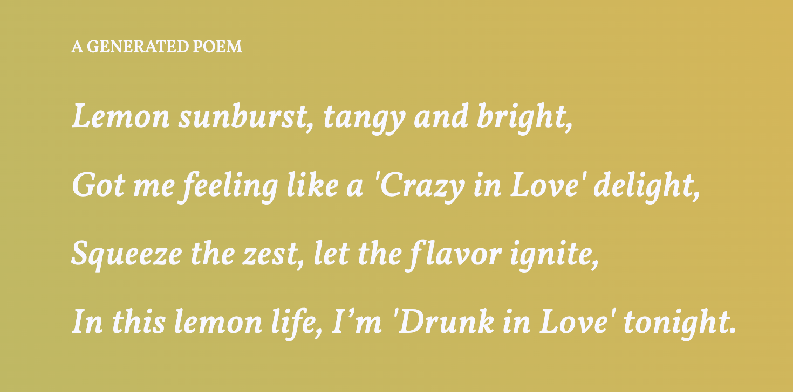

## Lemonade poem generator 🍋🐝👑
Learning project using `open-ai` API to generate poems. I've spiced it up with Beyonce lyrics.
Original work by [@hortfrancis](https://github.com/hortfrancis/lemon-poem-generator) with support from @codebar

## How to use

1. Clone the repository
2. Run `npm install`
3. Run `npm run dev`
4. Open your browser and go to `http://localhost:3000/`
5. Refresh the page to generate a new poem	

## Technologies used
- Node.js
- Express
- OpenAI API
- HTML
- CSS
- JavaScript

